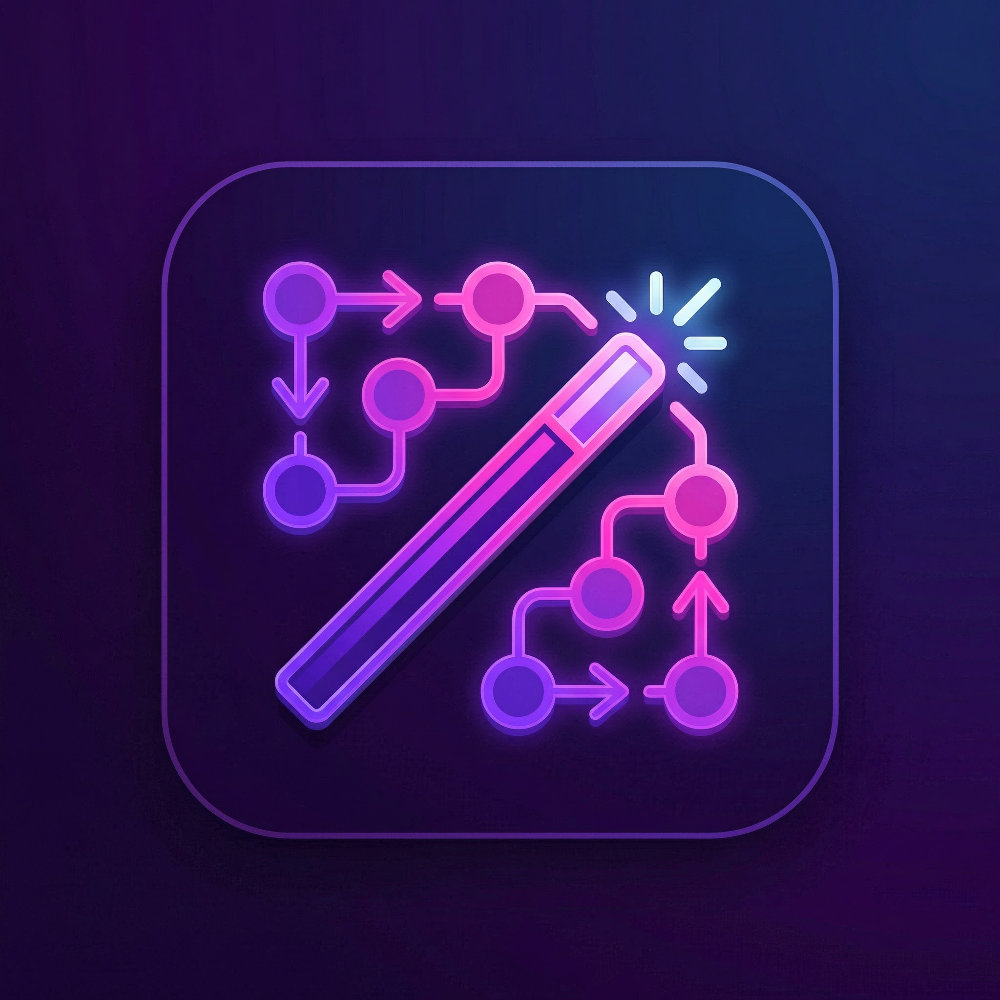
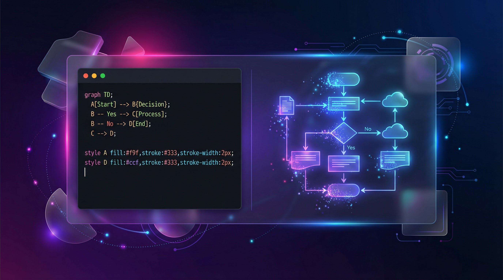

<div align="center">



# DiagramMagic

### Describe It. Diagram It. Done.

**AI-powered diagram generation — type what you want in plain English, get production-ready Mermaid diagrams instantly.**

[](https://diagrammagic.lovable.app)
[](https://www.typescriptlang.org/)
[](https://react.dev)
[](https://tailwindcss.com)
[](https://supabase.com)

[Try It Live](#-try-it-live) · [Features](#-features) · [Diagram Types](#-supported-diagram-types) · [Quick Start](#-quick-start) · [Templates](#-templates)

---



</div>

## The Problem

Creating diagrams is painful. Drag-and-drop tools are slow. Learning Mermaid syntax takes time. And when you need a quick flowchart for a meeting in 5 minutes, the last thing you want is to fight with a diagramming tool.

## The Solution

DiagramMagic lets you **describe any diagram in plain English** and generates production-ready Mermaid code instantly using AI. Edit the code, see the preview in real-time, export as SVG, and save to your library. No drag-and-drop. No learning curve. Just describe and done.

> *"Create a user authentication flow with login, signup, password reset, and email verification"*
>
> One prompt. One diagram. Ready to use.

---

## Try It Live

**[diagrammagic.lovable.app](https://diagrammagic.lovable.app)** — No signup required to try the editor.

---

## Features

- **AI Diagram Generation** — Describe what you want in natural language, powered by OpenAI
- **Live Code Editor** — Write or edit Mermaid syntax with instant preview rendering
- **9 Diagram Types** — Flowcharts, sequence diagrams, class diagrams, ER diagrams, Gantt charts, pie charts, state diagrams, user journeys, and git graphs
- **Template Library** — 12 professionally crafted templates across business, technical, and education categories
- **SVG Export** — Export any diagram as a high-quality SVG for presentations, docs, or websites
- **Save & Manage** — Save diagrams to your personal library with Supabase-backed persistence
- **Dark/Light Mode** — Full theme support for comfortable editing
- **3D Landing Page** — Immersive Three.js animated background on the landing page
- **Authentication** — Supabase Auth for secure user accounts and diagram ownership
- **E2E Testing** — Playwright test suite for critical user flows
- **Responsive Design** — Works on desktop and tablet

---

## Supported Diagram Types

| Type | Description | Use Case |
|---|---|---|
| **Flowchart** | Process flows with decisions and branches | Workflows, algorithms, decision trees |
| **Sequence** | Interaction between actors over time | API calls, system communication, protocols |
| **Class** | Object-oriented class relationships | Software design, data modeling |
| **ER** | Entity-relationship diagrams | Database schema design |
| **Gantt** | Timeline-based project schedules | Project planning, sprint timelines |
| **Pie** | Proportional data visualization | Budget breakdowns, survey results |
| **State** | State machine transitions | UI states, process lifecycles |
| **Journey** | User experience journey maps | UX research, customer experience |
| **Git** | Git branching and merge visualizations | Release strategies, branching models |

---

## Quick Start

### Prerequisites

- **Node.js** >= 18
- **npm** or **bun**

### 1. Clone and Install

```bash
git clone https://github.com/Alexi5000/diagrammagic.git
cd diagrammagic
npm install
```

### 2. Configure Environment

```bash
cp .env.example .env
```

Set your Supabase and OpenAI credentials in `.env`.

### 3. Start Development Server

```bash
npm run dev
```

Open [http://localhost:5173](http://localhost:5173) and start creating diagrams.

---

## Templates

DiagramMagic ships with **12 professionally crafted templates** organized by category:

### Business
- SWOT Analysis Matrix
- Customer Journey Map
- Sales Pipeline Funnel
- Organizational Chart

### Technical
- CI/CD Pipeline
- Microservices Architecture
- Database Schema (ER)
- API Sequence Flow

### Education
- Learning Path Flowchart
- Course Structure Gantt
- Knowledge Domain Class Diagram
- Student Journey Map

---

## Tech Stack

| Layer | Technology |
|---|---|
| **Framework** | React 18 + Vite |
| **Language** | TypeScript (strict mode) |
| **Styling** | Tailwind CSS + Shadcn/UI + Radix |
| **Diagrams** | Mermaid.js |
| **AI** | OpenAI API (via Supabase Edge Functions) |
| **Backend** | Supabase (Auth + Database + Edge Functions) |
| **3D Effects** | Three.js |
| **Testing** | Playwright (E2E) |
| **Data Fetching** | TanStack Query |

## 🎨 Template System

### How It Works

1. **Template Library**: 12 pre-built diagrams in `src/data/templates.ts`
2. **Navigation**: Click "Use Template" → `/editor?template={id}`
3. **Loading**: Editor reads URL param and loads matching template
4. **Validation**: Automated tests verify templates on every build

### Debugging Template Issues

**Open browser console and look for:**

✅ **Success Flow:**
```
✅ Templates module loaded {totalTemplates: 12, ...}
🎨 TemplateCard: User clicked "Use Template" {templateId: "tpl-business-funnel-003"}
🔍 Editor: URL params checked {templateId: "tpl-business-funnel-003"}
🎨 Editor: Loading template {totalTemplatesAvailable: 12}
✅ Editor: Template found and loaded {name: "Sales Funnel Pipeline", codeLength: 847}
```

❌ **Failure Flow:**
```
❌ Editor: Template not found {requestedId: "invalid-id", availableIds: [...]}
```

### Adding New Templates

1. Add to `templates` array in `src/data/templates.ts`
2. Use format: `tpl-{category}-{name}-{number}`
3. Include all required fields (id, name, description, code, type, category, difficulty)
4. Run tests: `npm run test`
5. Verify in browser console: Look for template ID in startup logs

## 🧪 Testing

Run tests:

```bash
npm run test        # Run once
npm run test:watch  # Watch mode
```

Test files follow the pattern `*.test.ts` or `*.spec.ts` and are placed alongside components or in `__tests__` directories.

## 🔒 Security

### Logging Strategy

All logging uses the centralized logger (`src/lib/logger.ts`):
- **Development:** All logs visible in console
- **Production:** Only errors logged (prevents sensitive data exposure)
- **ESLint enforced:** `no-console` rule prevents direct console usage

### API Key Storage

⚠️ **Demo/Testing Only:** API keys are stored in localStorage with explicit warnings.

**For Production:** Use Lovable Cloud or backend proxy with server-side secrets.

### Design Tokens

All magic numbers are centralized in `src/config/tokens.ts`:
- Timing values (debounce, animations)
- Dimensions (icons, buttons)
- Storage keys
- Validation limits

This ensures consistency and makes changes propagate automatically.
